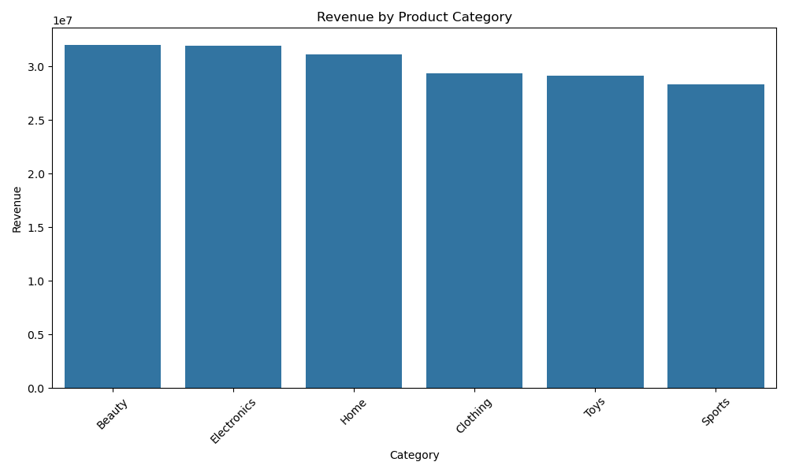
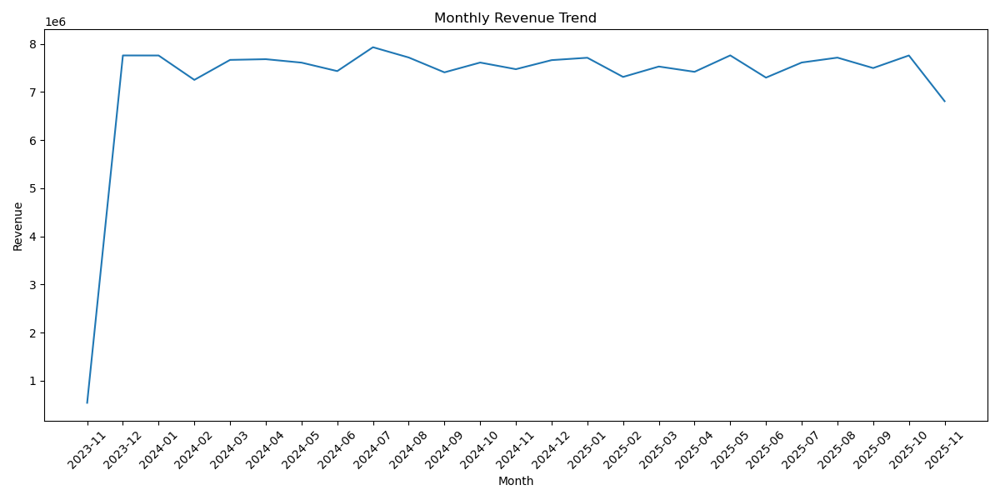
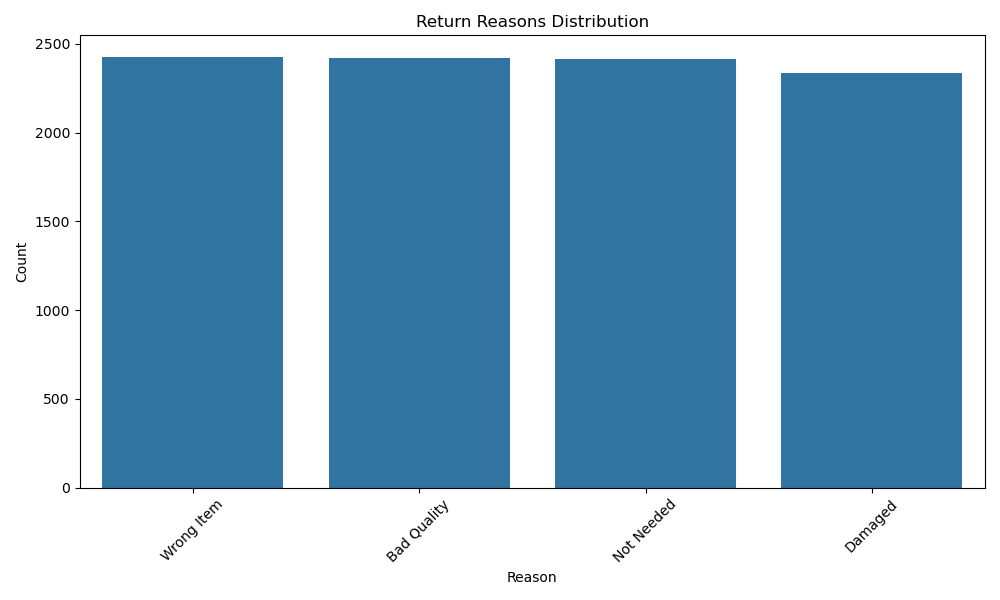

# E-commerce Sales, Returns, and Customer Behavior Analysis

This project simulates an end-to-end analytics workflow for an online retail business using synthetic e-commerce data. The goal is to understand revenue drivers, customer behavior, and return patterns in order to support data-driven decisions on marketing, inventory, and customer experience.

## Objectives
- Generate a realistic synthetic dataset for an e-commerce store (customers, products, orders, returns)
- Analyze sales trends, customer behavior, and return patterns
- Produce clear visualizations for business insights
- Save outputs for portfolio and GitHub presentation

## Dataset Overview
Generated using Python + Faker:

- `customers.csv`  
- `products.csv`  
- `orders.csv`  
- `order_items.csv`  
- `returns.csv`  

## Key Insights

### **1. Product Category Performance**
- Beauty, Electronics, and Home categories generated the highest revenue.
- Sports category had the highest number of orders, but the lowest revenue → low-margin products.
- Toys had the lowest order count but higher AOV → premium or bundled products.

---

### **2. Monthly Revenue Trend**
- Stable monthly revenue around $7.3M–$8M.
- No extreme seasonal spikes → consistent demand.

---

### **3. Customer Behavior**
- Top 10 customers spent **$18K–$21K** each.
- Google Ads, Referral, and Facebook were top revenue channels.
- Repeat customer rate: **68.85%** → strong retention.

---

### **4. Returns Analysis**
- Return rate: **8%**.
- Top return reasons (almost evenly split):
  - Wrong item  
  - Bad quality  
  - Not needed  
  - Damaged  

---

## Tech Stack
- Python  
- Pandas • NumPy  
- Matplotlib • Seaborn  
- Faker (data generation)  
- Jupyter Notebook  

## How to Reproduce
1. Install dependencies:
pip install pandas numpy faker matplotlib seaborn
2. Run notebooks/data_generation.ipynb to regenerate data
3. Run notebooks/ecommerce_analysis.ipynb to reproduce insights and visuals
